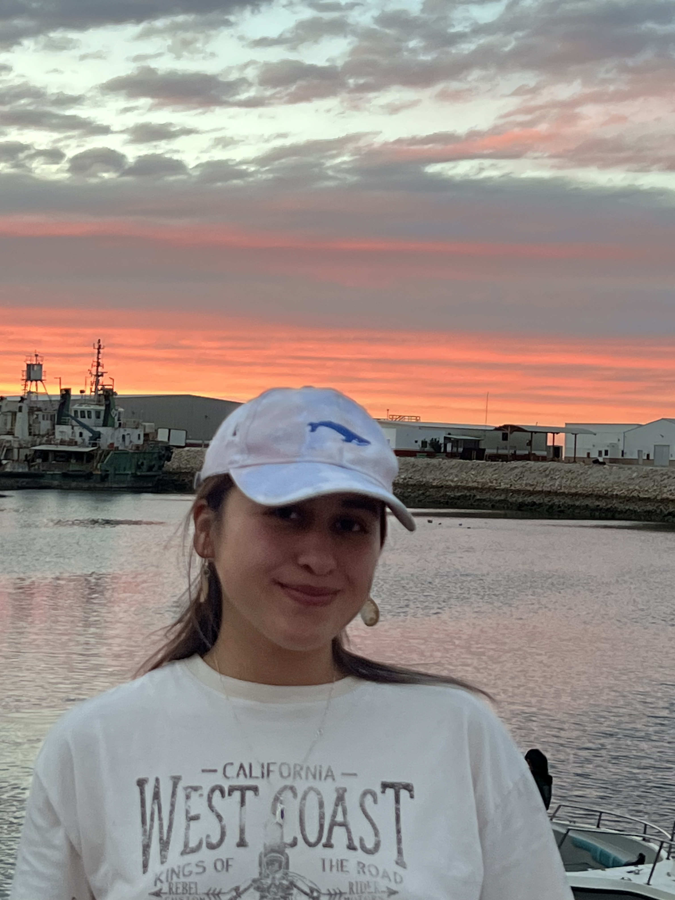
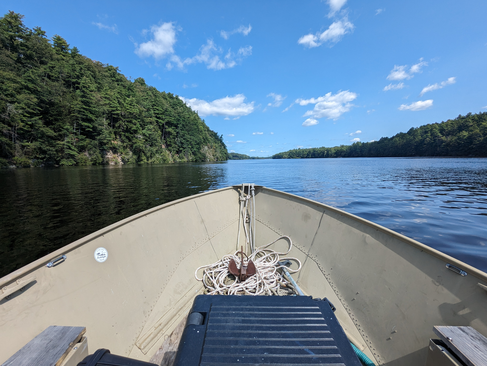

::: {.columns}
::: {.column width="32%"}

::: {.profile-panel}

{.profile-image width="100%" fig-alt="Vanessa Quintana"}

::: {.badge-list}
Ecology and Environmental Sciences, University of Maine

National Science Foundation: 3-D Ecosystem Science National Research Traineeship Fellow
:::

:::

:::
::: {.column width="68%"}

::: {.kicker}
About My Work
:::

I work at the intersection of hydrodynamics, sediment and contaminant transport, and fish behavior. My research focuses on how exposure actually emerges in real estuarine systems, not just where contamination exists on a map.

I approach modeling as a way to make processes visible. Instead of treating risk as static, I build frameworks that show how movement, interaction, habitat, and environmental variability combine to shape outcomes over time. My goal is to create tools that are transparent, reproducible, and genuinely useful for management and restoration.

:::{.callout-note appearance="minimal"}
## My Modeling Philosophy

**Transparent modeling.** I build models that clearly state assumptions, uncertainty, and limitations so they can be critiqued, interpreted, and improved rather than treated as black boxes.

**Co-development.** My work is shaped through collaboration with Tribal partners, federal agencies, local experts, and resource managers so that model structure and outputs reflect both ecological realism and decision context.

**Simplicity in complexity.** Complex systems do not require overly complicated tools. I focus on isolating the mechanisms that matter most while keeping models accessible, adaptable, and communicable.

**Decision support.** I design models to help people think through risk, compare scenarios, and identify where management actions may be most effective.
:::

:::
:::

::: {.section-divider}
:::

:::{.callout-note appearance="minimal"}
## How I Work

My research integrates field observations, spatial analysis, hydrodynamic modeling, and behavioral simulation. I use coupled approaches because exposure risk is not driven by one factor alone. It emerges from the interaction between material transport, habitat availability, and organism behavior.

This means my work often combines:

- hydrodynamic and sediment transport modeling
- life-stage habitat suitability modeling
- agent-based modeling of migration, schooling, foraging, and exposure pathways
- interactive tools for communication and decision support
:::

:::{.callout-note appearance="minimal"}
## Why This Work Matters

Estuarine systems are dynamic, and contaminant risk cannot be understood from environmental conditions alone. Exposure is not fixed in space. It emerges as organisms move through shifting hydrodynamic and ecological conditions.

That matters for fisheries management, restoration planning, and remediation because ecological recovery and contamination risk can occur at the same time in the same system. My work is aimed at making those interactions visible.
:::

::: {.section-divider}
:::

## Research Areas

::: {.columns}
::: {.column width="25%"}

::: {.research-card}
{.research-img fig-alt="Hydrodynamics"}

### Hydrodynamics

Flow regimes, tidal asymmetry, river discharge, and sediment transport as drivers of material movement through estuarine systems.
:::

:::
::: {.column width="25%"}

::: {.research-card}
{.research-img fig-alt="Agent-Based Modeling"}

### Agent-Based Modeling

Behavior, migration, schooling, and trophic interactions as mechanisms that transform potential exposure into realized risk.
:::

:::
::: {.column width="25%"}

::: {.research-card}
{.research-img fig-alt="Habitat Modeling"}

### Habitat Modeling

Life-stage-specific habitat suitability frameworks linking environmental gradients with when and where fish can persist.
:::

:::
::: {.column width="25%"}

::: {.research-card}
{.research-img fig-alt="Co-Development"}

### Co-Development

Collaborative model building with Tribal partners, agencies, and communities to improve transparency, relevance, and use.
:::

:::
:::

::: {.section-divider}
:::

## Featured Tools

::: {.tool-wrapper}

::: {.tools-intro}
Alongside publications and reports, I build public-facing tools and modeling products that support interpretation, communication, and applied decision-making.
:::

::: {.columns}
::: {.column width="50%"}

::: {.tool-card}
### [Mercury Risk Explorer](https://vkzfr3-vanessa-mahan.shinyapps.io/Mercury_Risk_Explorer)

Interactive application visualizing how hydrodynamics, habitat, and fish behavior structure mercury exposure risk in estuaries.
:::

:::
::: {.column width="50%"}

::: {.tool-card}
### [GoFish Toolkit](https://vmahan1998.github.io/GoFish)

Behavioral modeling toolkit for migratory fish with functions for movement, energetics, exposure, and ecological interaction.
:::

:::
:::

 

::: {.columns}
::: {.column width="50%"}

::: {.tool-card}
### [HyporheicFloPy](https://usace-wrises.github.io/HyporheicFloPy)

Automated groundwater and hyporheic modeling workflow built to support restoration and aquatic systems analysis.
:::

:::
::: {.column width="50%"}

::: {.tool-card}
### [River Herring Habitat Model](https://github.com/vmahan1998/RiverHerringHabitatModel_TechReport)

Transparent habitat suitability framework for alewife and blueback herring across life stages and changing estuarine conditions.
:::

:::
:::

:::