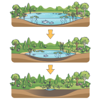
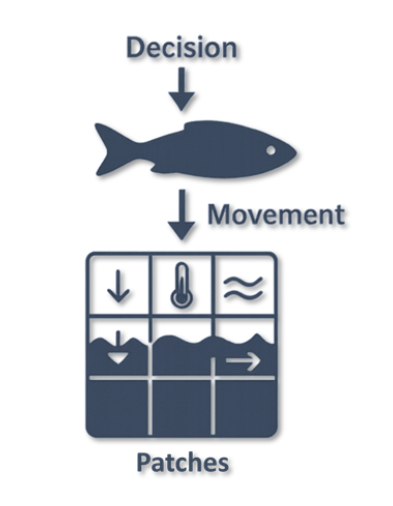
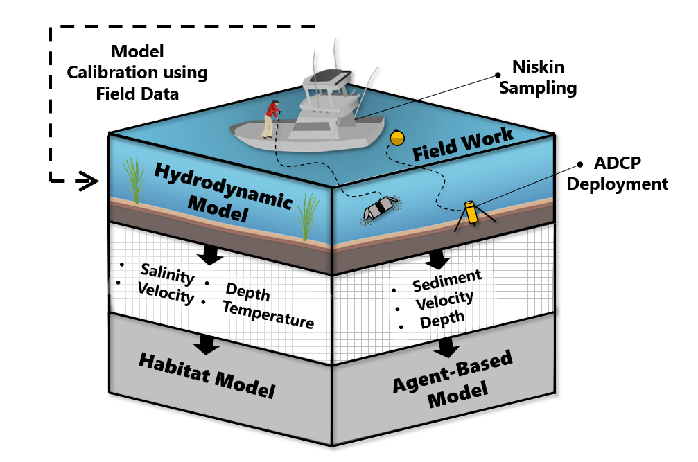

Ecological models help us understand how living systems behave and respond to change. They connect observations, data, and ecological theory to represent the processes that shape populations, habitats, and ecosystems. Rather than acting as perfect replicas of nature, they provide structured ways to explore complexity, test ideas, and support management decisions.

## Ecological Modeling {.tabset}

### Overview

Ecological modeling includes a wide range of approaches, from simple conceptual diagrams to fully coupled physical and biological simulations. Different approaches are useful for different questions, scales, and management needs.

My work focuses on developing ecological models that integrate biological behavior with environmental and physical processes. I build transparent and reproducible modeling frameworks that support science based decision making, assessment of ecological risk, and community engaged management.

#### Major model types

**Habitat Models**\
Spatial models that quantify environmental suitability and identify critical habitat across life stages and environmental conditions.

**Agent Based Models**\
Individual based simulations that capture behavior, movement, and interactions to explore emergent ecological patterns and system level responses.

**Coupled Models**\
Integrated physical biological models that connect hydrodynamics, habitat conditions, and contaminant exposure to evaluate how environmental change shapes population and ecosystem outcomes.

------------------------------------------------------------------------

### Habitat Modeling

```{=html}

```

#### What Are Habitat Models?

Habitat models describe how environmental conditions support, limit, or structure where organisms can survive, grow, and reproduce. These models translate environmental variables such as depth, temperature, velocity, salinity, and substrate into estimates of habitat availability or quality. Habitat models are widely used in conservation planning, restoration design, species assessments, and understanding how ecosystems respond to environmental change.

Habitat models range from simple conceptual frameworks to fully spatial, GIS based analyses. They help identify critical areas for life stages, evaluate habitat changes over space and time, and provide a foundation for linking physical processes with biological needs.

#### Habitat Suitability Indices (HSIs)

Habitat Suitability Indices (HSIs) are a common tool for evaluating habitat quality.\
An HSI represents how suitable a particular location is for a species or life stage on a scale from zero to one. Values close to one indicate highly suitable conditions, while values near zero indicate unsuitable habitat.

HSIs combine multiple environmental variables, each translated through species specific suitability curves. These curves describe how closely a given condition matches the known preferences or tolerances of the species. By combining these curves, HSIs allow researchers to map habitat quality across entire landscapes or river systems.

#### HSIs are useful because they allow researchers to:

-   evaluate habitat availability for different life stages
-   identify areas that may serve as critical habitat
-   compare conditions across years or scenarios
-   explore how environmental change affects habitat suitability
-   support restoration, management, and ecological forecasting

------------------------------------------------------------------------

#### Purpose of Habitat Modeling

Habitat models help translate environmental data into biologically meaningful information. They are especially valuable for species with complex life cycles, migratory patterns, or sensitivity to environmental change. These models support decision making by identifying where conditions meet species requirements and how these conditions shift under different scenarios.

For anadromous species, habitat models help reveal how hydrodynamics, temperature, salinity, and flow shape migration pathways and spawning conditions. When combined with behavioral models or contaminant assessments, habitat models serve as the foundation for understanding ecological risk and system dynamics.

------------------------------------------------------------------------

### Agent Based Modeling

```{=html}

```

#### What is an Agent Based Model?

Agent based models (ABMs) simulate the actions and interactions of individual organisms or “agents” moving through their environment. Each agent follows a set of simple rules related to movement, behavior, or decision making. When many agents operate at once, these individual rules can produce complex system level patterns that are difficult to predict from observation alone.

ABMs are useful for exploring behavioral ecology, migration pathways, risk exposure, predator and prey dynamics, and how organism level decisions scale to population or ecosystem outcomes. These models make it possible to represent variation, learning, spatial structure, and individual responses to environmental change in ways that support ecological understanding and management.

------------------------------------------------------------------------

#### Why Use ABMs?

<!-- ```{=html} -->

<!-- 

<!--      alt="Emergent Behaviors in Agent-Based Models" -->

<!--      style="float:right; width:300px; margin:0 20px 15px 0; -->

<!--             "> -->

<!-- ``` -->

ABMs represent individual behavior and decision making in ways that other modeling approaches cannot. They require advanced integration of ecology, behavior, spatial processes, and computation, along with careful validation to ensure that emergent patterns reflect real system dynamics. This makes ABMs demanding to build but exceptionally powerful for understanding complex ecological questions such as migration, risk exposure, and habitat selection in dynamic environments.

Agent based models are powerful tools because they allow researchers to:

-   represent individual variability\
-   link movement and behavior to environmental conditions\
-   explore emergent patterns\
-   test “what if” scenarios that are not possible to replicate in the field\
-   evaluate ecological risk and species responses in dynamic systems

ABMs are often paired with habitat models or physical models to understand how biology and hydrodynamics interact across space and time.

------------------------------------------------------------------------

#### Emergent Behaviors

One of the defining strengths of agent based modeling is the ability to observe **emergent behavior**, which occurs when simple individual rules create complex patterns at the group or system level. We can then examine these emergent properties to understand system-level responses.

Below are two examples demonstrating emergent behavior using different numbers of agents.

::::::: {style="display:flex; gap:10px; align-items:flex-start;"}
:::::: {style="flex:1;"}
<video controls autoplay loop muted style="width: 100%; border-radius: 12px;">

<source src="demos/Emergent_Behavior_Multiple_Agents_speed.mp4" type="video/mp4">

</video>

<p style="margin-top: 10px; font-size: 12px; color: #666;text-align:center;">

Emergent behavior with many agents interacting simultaneously

</p>

</div>

::::: {style="flex:1;"}
<video controls autoplay loop muted style="width: 100%; border-radius: 12px;">

<source src="demos/Emergent_Behavior_Two_Agents_speed.mp4" type="video/mp4">

</video>

<p style="margin-top: 10px; font-size: 12px; color: #666;text-align:center;">

Emergent behavior with two agents following basic interaction rules

</p>

</div>

</div>

##### Why ABMs Are Difficult to Build

-   They require translating ecological processes into explicit individual rules\
-   They must integrate movement, behavior, and environment at fine scales\
-   They demand careful attention to stochasticity, uncertainty, and variability\
-   They generate large spatial and temporal datasets that require efficient computation\
-   They need rigorous testing to ensure that emergent patterns match real world observations\
-   They often must combine multiple domains such as environmental dynamics, animal behavior, physiological limits, and ecological interactions.

------------------------------------------------------------------------

#### What Makes ABMs Unique

Agent based models offer capabilities that are not achievable with most other ecological modeling approaches. They require a blend of ecological understanding, behavioral theory, spatial analysis, and computational skill that makes them both powerful and technically demanding.

ABMs stand out because they allow researchers to represent how individuals perceive their environment, make decisions, and interact with physical and biological processes. This perspective creates opportunities to study behaviors, risks, and system responses that are invisible in population level or equation based models.

ABMs also require advanced model design, careful rule construction, and rigorous validation to ensure that individual decisions scale realistically to emergent outcomes. This level of detail and transparency demands a strong understanding of both ecological processes and computational implementation.

------------------------------------------------------------------------

##### Why This Expertise Matters

Because ABMs simulate decision making and behavior, they can capture risk pathways, migration patterns, predator interactions, and exposure processes that other models cannot represent. This capability is especially important in systems where individual behavior determines ecological outcomes, such as tidal river migration, contaminant exposure, and habitat selection.

Developing these models requires skills in simulation design, ecological theory, spatial modeling, and transparent validation. My work combines these elements to create agent based models that are both scientifically grounded and directly useful for management planning.

------------------------------------------------------------------------

#### What Are Coupled Models?

Coupled models combine multiple processes into a single integrated framework.\
These models link physical, chemical, and biological systems to explore how different components of an environment interact across space and time. In ecological applications, coupled models often blend hydrodynamics, habitat conditions, contaminant transport, and species behavior.

By pairing these elements, researchers can ask questions about how environmental change influences ecological outcomes, how individual decisions scale to population effects, and how physical processes shape risk and exposure.

------------------------------------------------------------------------

#### Why Use Coupled Models?

Coupled models are valuable because they allow researchers to:

-   represent interactions between physical and biological systems\
-   simulate environments that shift over space, time, and tidal cycles\
-   assess ecological risk under multiple scenarios\
-   capture processes that cannot be studied through a single model type\
-   evaluate management actions, restoration strategies, or environmental change

They provide a framework for understanding complex systems where no single model can capture the full story.

------------------------------------------------------------------------

#### Integration and Complexity

Coupled models require careful coordination of multiple data streams, modeling domains, and temporal scales. Integrating hydrodynamics, habitat suitability, and behavior requires:

-   aligning spatial grids and coordinate systems\
-   synchronizing time steps across model types\
-   ensuring feedback between processes is realistic and biologically meaningful\
-   validating each component independently and in combination\
-   managing large computational workloads and high-resolution datasets

This level of integration makes coupled models powerful, but also technically complex. Successful implementation requires strong interdisciplinary knowledge, transparent workflows, and reproducible coding practices.

------------------------------------------------------------------------

#### Cost–Benefit of Coupled Modeling

While complex, coupled models offer significant advantages:

##### Benefits

-   more realistic representation of ecological systems\
-   improved understanding of risk, exposure, and environmental change\
-   insight into processes that cannot be observed directly\
-   support for management decisions based on integrated system behavior

##### Costs

-   higher computational demands\
-   greater model development time\
-   increased need for interdisciplinary expertise\
-   more detailed validation and scenario testing\
-   larger, more complex datasets to maintain

Despite these challenges, the benefits often outweigh the costs, especially in systems where physical processes strongly influence ecological outcomes. Coupled approaches allow researchers to understand not only where and when organisms move, but why those movements occur in a dynamic environment.

------------------------------------------------------------------------

#### Coupled Models Address Complex Environmental Problems

::: {style="height:4px; width:100%; margin:40px 0;"}
:::

Estuaries like the Penobscot River are shaped by spatial patterns of contamination, tidal asymmetry, sediment resuspension, and shifting habitat conditions.\
These processes operate across scales and cannot be captured by any single model.

::: {style="text-align:center; margin:30px 0;"}
{style="max- border-radius:12px; box-shadow:0 4px 12px rgba(0,0,0,0.15);" fig-align="center"}

<p style="font-size:14px; color:#666; margin-top:12px;">

Spatial and temporal processes that drive contamination transport, habitat dynamics, and anadromous fish behavior in macrotidal estuaries.

</p>
:::

Coupled models are valuable because they allow researchers to:

-   represent interactions between physical and biological processes\
-   simulate environments that shift over space, time, and tidal cycles\
-   assess ecological risk under multiple scenarios\
-   evaluate where, when, and why exposure or habitat use occurs\
-   guide restoration and management decisions with integrated system insight

------------------------------------------------------------------------

#### Learn More

-   [Learn to Code →](tools/coding/coding_basics.qmd)\
-   [Version Control →](tools/coding/github/version_control.qmd)\
-   [Co-Development →](tools/workshop/index.qmd)

:::::

::::::

:::::::
:::::
::::::
:::::::
